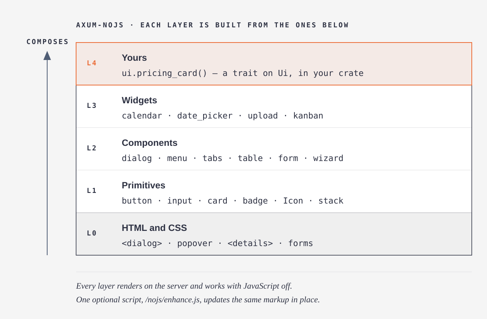
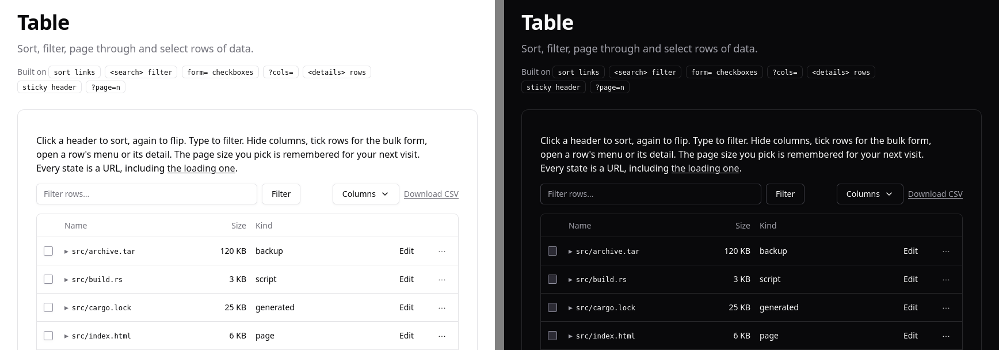

# loco-ui

**[Live demo](https://luis-serrano-l.github.io/loco-ui/)** (every component, static snapshot on
GitHub Pages) · **[Source on GitHub](https://github.com/luis-serrano-l/loco-ui)**

**HTML first, script optional** · every page works with JavaScript off, checked in CI by a
script-less renderer ([Blitz](loco-ui-test/tests/demo.rs)) and
[a test that allows one optional script and nothing inline](demo/src/tests.rs) · strict CSP ·
axe-clean: no serious or critical violation on any demo route, both capability variants,
light and dark ([browser check](scripts/browser-check.mjs), in CI)

**Server-rendered UI components for Loco and Axum.** Buttons, forms, dialogs, tables, a
calendar, uploads and a kanban board, written in Maud, in shadcn/ui's look. The HTML and CSS
platform does the interactive work (`<dialog>`, `popover`, `<details>`, forms that post and
redirect). One optional 11 KB script makes those forms and links update the page in place
instead of reloading it; block it and every page still works. On Loco, a scaffold generates
HTML controllers and Maud views for a model. The core is plain functions over strings, so it
also works with any other Rust server.



Each layer is built only from the ones below it: components from primitives, widgets from
components and primitives, and yours from any of them (`docs/components.md`), so one change to
the button restyles every dialog, table and form, including yours.

| | loco-ui | Leptos, Dioxus | htmx + hand-written Maud |
|---|---|---|---|
| Where the UI runs | server, HTML out | Rust compiled to WebAssembly in the browser, rendered first on the server | server |
| JavaScript needed for it to work | none; one optional 11 KB script updates the page in place | the WASM bundle and its JS glue, to hydrate | the htmx library, for every `hx-` attribute |
| With script blocked | every page works; CI proves it with a script-less renderer (Blitz) | server-rendered HTML shows; interactivity stops | whatever you wrote as plain links and forms |
| Components | primitives, components and widgets, themed by tokens | from the ecosystem, or your own | your own |
| State | URL, cookies, form posts (Post/Redirect/Get) | signals in the browser, server functions | on the server, swapped fragments |

`docs/comparison.md` goes further, with maud-ui, CSP and the API shape side by side, and
`docs/audiences.md` says who it is for and which guarantee each of them relies on.
Pick Leptos or Dioxus for an app that reacts on every keystroke (an editor, a live canvas).
Pick this for the admin panels, dashboards, settings pages, forms and content sites that
refresh per action, where it gives the same components with nothing to hydrate.

Every component starts from `ui`, the one value a handler extracts, and renders where `html!`
splices it. Interactivity comes from the HTML/CSS platform and ordinary form round trips. One
optional 11 KB script (`/lui/enhance.js`) makes the same markup update in place; see "How the
script works" below. Every page works identically with the script blocked; that is the only
`<script>` tag allowed, and a test enforces it.



```rust
use axum::{Form, Router, routing::get};
use loco_ui::prelude::*;
use serde::{Deserialize, Serialize};

#[derive(Default, Deserialize, Serialize)]
struct Settings { name: String }

// `Ui` is what the server knows about this browser, its theme and the page's UI state.
// `lui!` is Maud's `html!` with components written like elements.
async fn show(ui: Ui, Saved(s): Saved<Settings>) -> Page {
    ui.page("Account", lui! {
        Flash;
        Form("/account") submit="Save" { text "name" "Name" required value=(&s.name); }
        Dialog("Delete account") danger confirm=("Delete", "/account/delete") {
            p { "This cannot be undone." }
        }
    })
}

// Post/Redirect/Get: a 303 back, a flash, the value kept in a cookie.
async fn save(ui: Ui, Form(s): Form<Settings>) -> Redirect {
    ui.redirect("/account").ok("Saved.").save(&s)
}

let app = Router::new()
    .route("/account", get(show).post(save))
    .merge(loco_ui::caps::router())     // the beacons that tell the server what the browser supports
    .merge(loco_ui::enhance::router()); // the optional script
```

Each element is the builder a route could also chain by hand, and `lui!` expands to exactly
that: `Form("/account") submit="Save" { text "name" "Name" required; }` is
`ui.form("/account").submit("Save").text("name", "Name").required()`. Attributes are setters
(`x="v"`, a bare `x` switches on, `x[cond]` only when `cond`, `x=[option]` only for `Some`),
items take their modifiers as attributes, and `@for`/`@if` build items from data. A typo is
rustc's own "no method named `requird` … did you mean `required`" at the attribute.
`loco_ui::props()` lists every component's setters with kind, arguments, default and the
HTML attribute they set; the demo shows them as a table on each page.

With `loco-ui = { features = ["axum"] }`. Without Axum, `Ui::from_request(path, query,
cookies)` or `Ui::from(Caps::all())` gives the same builders and `.render().into_string()` the
HTML; `loco-ui/examples/hyper_server.rs` shows a raw hyper server.

## Run the demo

```sh
cargo run -p demo      # http://127.0.0.1:3000: index grouped by what the platform gives, every page links back
cargo dev              # same, restarted when Rust source changes (cargo install cargo-watch)
cargo test             # includes: only the enhancement <script> on any route, and Blitz layout tests
scripts/verify.sh      # build + clippy -D warnings + tests + screenshots + <script> grep + Firefox check
scripts/snapshot.sh    # static snapshot of every page into target/site/ (no script, relative links, a banner)
```

The index lists every component in groups (overlays, disclosure, navigation, input, feedback,
server state), each with one line on what it is for and the platform features it is built on.
A component page shows the live component with the code that drew it joined underneath: the
lines between `// code: <href>` and `// end code` in `demo/src/routes/`, cut from those files at
compile time so the page and the code cannot drift, and highlighted on the server by
[syntect](https://crates.io/crates/syntect), a dependency of the demo only, coloured with the
`--lui-*` tokens. To show more of a handler, move its markers.

Under the code, every builder on the page has its props table, generated from its `PROPS`. For
17 builders (button, badge, alert, card, input, chart, …) the table is a playground: a GET form
with a control per switch, text or number prop that re-renders the component with the chosen
props and writes the matching `lui!` line (`demo/src/playground.rs`). It works with script off
(the choice is in the URL, `?pg.Button.primary=true`), and the enhancement script swaps it in
place. Builders fed lists, rows or markup keep a read-only table.

`loco-ui-test` renders every route through [Blitz](https://github.com/DioxusLabs/blitz)
(Stylo + Taffy + vello_cpu, no script engine) and writes a PNG per route and capability level
to `tests/shots/`, which is also the proof that every route works with no script. What Blitz
cannot render is listed with issue links in `FINDINGS.md`. `scripts/browser-check.mjs` drives
headless Firefox through geckodriver to check the enhancement script (in-place counter, tabs,
search as you type, in-place table sort, wizard steps, live range output, theme).

## Use with Loco

On [Loco](https://loco.rs), `cargo lui install` (from `cargo install --git
https://github.com/luis-serrano-l/loco-ui loco-ui --bin cargo-lui`) sets an app up in one
command: the dependency with the `loco` feature, the scaffold templates, a layout view and
this line in `App::initializers`; controllers then take `ui: Ui` like any Axum handler and return `Result<Page>` or
`Result<Redirect>`:

```rust
async fn initializers(_ctx: &AppContext) -> Result<Vec<Box<dyn Initializer>>> {
    Ok(vec![Box::new(loco_ui::loco::Initializer)])
}
```

`loco::Valid<T>` is a form extractor that hands the handler `Ok(T)` or every field's
message plus what was typed, so a bad form is shown again instead of answered with an error
(`loco::FieldErrors` does the same for Loco's model validation), and `loco-ui/loco-templates/` makes
`cargo loco generate scaffold` write an HTML controller and Maud views (Post/Redirect/Get,
paging, validation) instead of a JSON API. `cargo lui auth` adds sign-in, sign-up, forgot and
reset password, email verification and magic-link pages, all forms, with Loco's JWT in an
`HttpOnly` cookie. [`examples/loco-app`](examples/loco-app) is a generated app, tested through
Loco's router and Blitz; [`docs/loco.md`](docs/loco.md) covers install, controllers, forms,
sign-in, the generator and the Loco settings that affect pages.

## Blocks

Whole pages from the components, each a builder like any component and one file under
`loco-ui/src/blocks/` to copy when yours differs: `ui.app_shell(..)` (sidebar navigation that
is a drawer on narrow screens, who is signed in), `ui.auth_page(..)`, `ui.settings_page(..)`,
`ui.record_page(..)`, `ui.dashboard_page(..)` and `ui.error_page(404 | 500)`.
`loco_ui::blocks::not_found` is a `Router::fallback` handler, so unknown paths get the 404
page in the site's look (the demo and `examples/loco-app` use it).

## Languages

The words components write themselves ("Next", "Load more", "Rows per page", month names)
come from one table, `i18n::Strings`, picked per request from the `lui-lang` cookie or
`Accept-Language`; `<html lang>` follows. English is built in; an app adds a language with
`Strings::new("es").with(Text::Next, "Siguiente")…` or fills one from Loco's fluent files
(`Strings::from_lookup`). The demo has Spanish (the switch beside the theme toggle), and a
test fails when a component writes English outside the table.

## Use with any server

The crate depends on Maud alone. Axum is an optional feature, and everything it does is a
thin wrapper over plain functions on strings, so any server can do the same in a few lines:

| You need | Without a framework | With `--features http` | With `--features axum` |
|---|---|---|---|
| What the browser supports | `Caps::from_query(query)` then `Caps::from_cookie_header(cookies)` | same | `caps: Caps` extractor |
| The beacon route `GET /lui/caps?flag=x` | `caps::beacon_cookie(query)` → 204 + `Set-Cookie`, or 404 | same | `caps::router()` |
| Caps, theme, tab/accordion/dialog state, query | `Ui::from_request(path, query, cookies)` | same | `ui: Ui` extractor |
| A whole page | `ui.page(title, body).into_string()`, `page.set_cookies()` | same | return the `Page` |
| Post/Redirect/Get with a flash | `ui.redirect(to).ok(msg)`: `.location()`, `.set_cookies()` | `.into_http()` → `http::Response<B>` | return the `Redirect` |
| A value kept in a cookie | | | `Saved<T>` extractor, `redirect.save(&value)` |
| Out-of-order streaming | | `Streamed::into_stream()` → chunks | `impl IntoResponse for Streamed` |
| The optional script | serve `enhance::JS` at `enhance::SCRIPT_PATH` | same | `enhance::router()` |

`loco-ui/examples/hyper_server.rs` is the whole of it on raw hyper: three components, the
beacon route, a POST answered with PRG, the script served by hand. `.into_string()` on any
component gives the HTML to another template engine.

## How to read this crate

- One component = one file in `loco-ui/src/`. Each starts with a `//!` header: what it does,
  the platform features it uses (with browser baseline), the fallback, a usage example.
- One import, `use loco_ui::prelude::*`. Every component is a method on `Ui` returning a
  builder: required arguments in the call, everything else a chained setter named after what
  it changes (`ui.dialog("Delete account").title("Delete account?").danger()`). Setters such as
  `.required()`, `.icon()`, `.badge()` apply to the item added last (a field, a menu item, a
  tab). Ids come from the label; state (`?tab.x=`, `?dialog=`, `?page=`, `?sort=`) is read
  from `ui`, so a route passes only what the page says differently. No macros beyond `html!`.
- Primitives come first: `ui.button`/`ui.link_button`, `ui.input`/`ui.checkbox`/`ui.switch`/
  `ui.radio_group`, `ui.badge`, `ui.card`, `Icon` (31 Lucide shapes as inline SVG),
  `ui.avatar`, and the layouts `ui.stack`, `ui.cluster`, `ui.grid(min, ..)`, `ui.split(side,
  main)` with `.gap(n)` on a `--lui-space-*` scale. Components are built from them (`ui.form`
  renders its fields through `input.rs`), and so can yours: `docs/components.md` writes one in
  about 30 lines (an extension trait on `Ui`, `impl Render`, a CSS const passed to
  `Page::css`), and its code runs as a doctest.
- `Caps` is server-side feature detection with no script: `@supports` beacons set one cookie per
  capability, and each component emits only the variant that browser needs (see `/caps`).
  `?caps=popover,anchor` on any URL forces a set. The protocol is three plain functions
  (`Caps::from_cookie_header`, `Caps::from_query`, `caps::beacon_cookie`); Axum only wraps them.
- Output HTML is semantic with one `lui-<component>` class per root. `curl` any page and read it.
- CSS lives beside its component as `const CSS`. Theming is via `--lui-*` custom properties only
  (shadcn/ui's roles: `bg`, `fg`, `muted`, `line`, `surface`, `card`, `popover`, `secondary`,
  `accent`, `on-accent`, `primary`, `on-primary`, `input`, `ring`, `danger`, `ok`, `warn`, `radius`, `space`;
  the default is shadcn's neutral zinc theme, with system fonts and Radix step-11 status colours).
  `Tokens::css()` also derives `--lui-radius-sm`/`-lg`, `--lui-shadow-xs`/`-lg` and
  `--lui-overlay` from them; `--lui-font-sans` and `--lui-font-mono` can be overridden on `:root`.
  `layout::Tokens` holds them for light and dark, `ui.page(..).tokens(&t)` applies another set
  once per page, and `docs/theming.md` says what each one affects and which pairs must keep contrast.
  `/?palette=linen` in the demo is the same index under a second palette.
  `scripts/look.sh` shoots every demo page (light and dark, 1280 and 420 wide) beside the
  matching shadcn docs page, for comparing the look by eye.
  A test fails if any component CSS names a colour instead of a token.

## What a page weighs

Measured on the demo (M29), gzip at level 9; every page inlines the whole stylesheet, so
there is no second request for CSS, and no script is required.

| | raw | gzip |
|---|---|---|
| The whole stylesheet, every component and block (`stylesheet()`) | 69.6 KB | 12.3 KB |
| A demo page, stylesheet and props tables included (`/nav` … `/calendar`) | 78–101 KB | 14.5–16.8 KB |
| `/stream` with declarative shadow DOM (the stylesheet twice: once for the shadow root) | 145 KB | 25.0 KB |
| JavaScript required | 0 | 0 |
| The optional script, `/lui/enhance.js` (cached forever) | 10.6 KB | 3.6 KB |

For comparison, `maud-ui` 0.20.3 (the same stack and look) ships 313 KB of CSS (44 KB gzipped)
and needs an 89 KB script (24 KB gzipped) plus htmx. Two tests keep these numbers honest: the
stylesheet stays under 72 KB, and every demo page under 104 KB (152 KB for the shadow-DOM
stream) in `cargo test`. (Before M29 added the blocks, the chart and six more components, the
same limits were 64, 96 and 128 KB.)

### How fast an update lands

With the optional script, a click updates its part of the page in place. Measured from the
click to the frame that shows the new state, in headless Firefox against the release demo on
the same machine, beside htmx 2.0.11 swapping the same server answer into the same element
(`scripts/bench-swap.mjs`, 30 runs each, median / 90th percentile, ms):

| Update | loco-ui script | htmx 2 |
|---|---|---|
| Sort a table (26 KB answer) | 35 / 50 | 41 / 51 |
| Open a tab | 13 / 18 | 14 / 26 |
| Load more rows (4 KB answer) | 32 / 35 | 22 / 35 |

An answer that arrives within 150 ms lands at once; a slower one morphs in a view transition
(a root marked `data-lui-morph`, like the kanban board, always morphs). Without the script
each of these is an ordinary page load of the same URL.

## Strict Content-Security-Policy

Nothing is inline but styles, so pages run under a strict policy. `enhance::csp` is an Axum
middleware that sends it on every HTML answer (the demo layers it):

```text
default-src 'self'; script-src 'self'; style-src 'self' 'unsafe-inline'; img-src 'self' data:;
object-src 'none'; base-uri 'none'; form-action 'self'; frame-ancestors 'none'
```

`script-src 'self'` allows exactly one file, `/lui/enhance.js`; there are no inline scripts,
`on*` handlers or `javascript:` URLs (a test checks every route). A page built with
`Page::without_script()` has no script tag at all and gets `script-src 'none'`
(`enhance::CSP_NO_SCRIPT`); in the demo, add `?script=off` to any page. Styles need
`'unsafe-inline'`: the stylesheet is inlined once per page, and a few per-element values (a
grid's minimum width, a view-transition name) travel in `style` attributes. The Firefox check
(`scripts/browser-check.mjs`) runs every enhanced interaction under this policy.

## How the script works

`/lui/enhance.js` is one file, plain ES2020, served with a content hash so it caches forever
and compatible with `script-src 'self'`. It never changes what the server sends: it reads a
few `data-lui-*` attributes and does in place what the browser would have done as a full
navigation. Without it every attribute is inert and every control is a normal form or link.

| Attribute | On | What the script does | Without the script |
|---|---|---|---|
| `id` + `data-lui="swap"` | a root element | Forms and links inside it are fetched; the element of the same `id` in the answer replaces the root. Flash, `<title>`, `data-theme` and the URL follow. Requests on one root are queued. | Normal navigation to the same URL. |
| `data-lui-target="#id"` | a form or link, or an ancestor | Swaps that root instead of the closest one, so a control can sit anywhere. | Same navigation. |
| `data-lui-swap="outer\|inner\|append\|prepend"` | with `data-lui-target` | How the answer lands: replace the root, replace its children, add at the end or the start. | Same navigation; the full page already shows the result. |
| `data-lui-oob="outer\|inner\|…"` | an element in the answer | Replaces the element of the same `id` anywhere in the page and is dropped from the main swap. | The full page shows it in place. |
| `Lui-Enhance: 1` | the request header | Sent on every enhanced request, so a handler may answer with only the fragment it needs to (`/swap` does). | Not sent; the handler returns the page. |
| `data-lui-busy` + `aria-busy="true"` | set by the script on the root and the form | Present while a request is in flight; submit buttons are disabled meanwhile; `[data-lui-busy]` fades to `--lui-busy` (0.6). | Never set. |
| `data-lui-indicator="#id"` | a form or link | The named element (authored with `hidden`) is shown while the request runs. | Stays hidden. |
| `data-lui-push="false"` | a form or link | The URL does not change. Links push a history entry by default, forms replace it. | Normal navigation. |
| `data-lui-replace` | a form or link | `replaceState` instead of `pushState`. | Normal navigation. |
| Back and Forward | | Each swap stores a copy of every root in the history entry; Back and Forward restore from it with no request. Entries without a copy are re-fetched. | Normal history. |
| `lui:swap` | a bubbling `CustomEvent` on the swapped root | `detail` is `{ id, url, mode }`, for anything that must react; no listener ships with the crate. | Never fires. |

A request that fails (network down, the answer has no element of that `id`) becomes the
navigation the browser would have made, so the server's answer is always seen. The script also
mirrors `<input type=range>` and `type=color` values while they move, opens the `:target`
dialog fallback as a real modal, closes the `<details>` popover fallback on outside click, and
searches a combobox as you type. `scripts/browser-check.mjs` proves each of these in headless
Firefox; the Blitz suite proves every route with no script engine at all.

## Feature matrix

Generated from `loco_ui::spec::SPECS` by `cargo run -p demo -- spec write` (a test fails if it
drifts). Versions are the first release of each engine with the feature, from MDN
browser-compat-data; `no` means unshipped, so that browser gets the fallback.

<!-- matrix:start -->
| Component | Platform features | Chrome / Firefox / Safari | Fallback | Needs JS? |
|---|---|---|---|---|
| Enhancement script | `fetch`, `history.pushState`, `document.startViewTransition`, `CustomEvent` | 42 / 39 / 10.1; 5 / 4 / 5; 111 / 144 / 18; 15 / 11 / 6 | none needed: without the script every form and link is a normal navigation and every data-lui-* attribute is inert | No |
| Layout | `@view-transition`, `prefers-color-scheme`, `custom properties` | 126 / no / 18.2; 76 / 67 / 12.1; 49 / 31 / 9.1 | plain navigations (root never cross-fades); colours still switch by media query and data-theme | No |
| Capability beacons | `@supports`, `selector()`, `background images`, `cookies` | 28 / 22 / 9; 83 / 69 / 14.1; 1 / 1 / 1; 1 / 1 / 1 | unknown browser gets every fallback; the first view always does | No |
| Button | `invoker commands`, `popovertarget`, `aria-busy`, `prefers-reduced-motion` | 135 / 144 / 26.2; 114 / 125 / 17; 1 / 1 / 1; 74 / 63 / 10.1 | a popover command becomes popovertarget; other commands need the component's own fallback | No |
| Input, checkbox, switch, radio group | `constraint validation`, `type=date`, `:user-invalid`, `role="switch"`, `appearance: none`, `<fieldset>` | 10 / 4 / 10.1; 20 / 57 / 14.1; 119 / 88 / 16.5; 1 / 1 / 1; 84 / 80 / 15.4; 1 / 1 / 1 | none needed: native controls; the switch stays a checkbox without appearance: none | Partly: a live character count while typing needs the enhancement script |
| Badge | `<span>` | 1 / 1 / 1 | none needed | No |
| Card | `grid` | 57 / 52 / 10.1 | none needed | No |
| Icon | `<svg>`, `role="img"` | 4 / 3 / 3.2; 1 / 1 / 1 | none needed | No |
| Avatar | `alt=""`, `loading="lazy"`, `role="img"` | 1 / 1 / 1; 77 / 75 / 15.4; 1 / 1 / 1 | the initials are the fallback | No |
| Stack | `gap` | 84 / 63 / 14.1 | none needed | No |
| Cluster | `flex-wrap`, `gap` | 29 / 28 / 9; 84 / 63 / 14.1 | none needed | No |
| Grid | `repeat(auto-fill`, `@media` | 57 / 52 / 10.1; 1 / 1 / 1 | none needed | No |
| Split | `flex-wrap`, `min-inline-size` | 29 / 28 / 9; 57 / 41 / 12.1 | none needed | No |
| Calendar | `<table>`, `aria-current="date"`, `role="radiogroup"`, `:has(:checked)` | 1 / 1 / 1; 1 / 1 / 1; 1 / 1 / 1; 105 / 121 / 15.4 | without :has() the picked radio's day is not filled in; it is still checked and posts | Partly: changing month in place and arrow-key moves between days need script |
| Date picker | `popover`, `anchor-name`, `<input type="date">` | 114 / 125 / 17; 125 / 147 / 26; 20 / 57 / 14.1 | without popover the calendar is laid out in the form; .native() is the browser's own control | Partly: writing the picked day onto the button before the form is sent needs script |
| Dialog | `<dialog>`, `command="show-modal"`, `<form method="dialog">`, `closedby` | 37 / 98 / 15.4; 135 / 144 / 26.2; 37 / 98 / 15.4; 134 / 141 / 26 | link to #id opens it through a :target rule, chosen server-side; the confirm footer is a plain form either way | No |
| Popover menu | `popover`, `anchor-name` | 114 / 125 / 17; 125 / 147 / 26 | no anchor: UA-centred popover; no popover: <details> dropdown (submenus nested); actions are plain post forms either way | No |
| Tabs | `<details name`, `display: contents`, `::details-content`, `view-transition-name` | 120 / 130 / 17.2; 65 / 37 / 11.1; 131 / 143 / 18.4; 111 / 144 / 18 | accordion markup, chosen server-side; the narrow-screen select has a Go button | No |
| Accordion | `<details name`, `::details-content`, `interpolate-size` | 120 / 130 / 17.2; 131 / 143 / 18.4; 129 / no / no | plain <details>: no exclusivity, no animation; expand/collapse and every toggle are links either way | No |
| Combobox | `<datalist>`, `<optgroup>`, `<search>`, `aria-live` | 20 / 4 / 12.1; 20 / 4 / 12.1; 118 / 118 / 17; 1 / 1 / 1 | none needed: chips, results and the create row are links and forms | Partly: static suggestions and per-submit results; live filtering and arrow keys into the results need script |
| Load-more list | `view-transition-name`, `scroll-margin` | 111 / 144 / 18; 69 / 90 / 14.1 | plain navigation to ?page=n#more | Partly: click-to-load; scroll-to-load needs script |
| Table | `?sort=<col>&dir=asc|desc`, `<search>`, `aria-sort`, `form attribute`, `<details>`, `<colgroup>`, `tabular-nums`, `position: sticky`, `view-transition-name`, `aria-busy` | 1 / 1 / 1; 118 / 118 / 17; 1 / 1 / 1; 10 / 4 / 5.1; 12 / 49 / 6; 1 / 1 / 1; 52 / 34 / 9.1; 56 / 32 / 13; 111 / 144 / 18; 1 / 1 / 1 | none needed: sorting, filtering, column choice and the bulk form are plain navigations and posts; no select-all without script | No |
| Paged table | `?page=n`, `<select>`, `<input type="number">`, `<output>` | 1 / 1 / 1; 1 / 1 / 1; 6 / 29 / 5.1; 10 / 4 / 7 | none needed: every control is a link or a form | No |
| Wizard | `<form method="post">`, `aria-current="step"`, `<fieldset>`, `formnovalidate`, `<progress>` | 1 / 1 / 1; 1 / 1 / 1; 1 / 1 / 1; 4 / 4 / 5; 8 / 16 / 6 | none needed: one form per step, PRG between them | No |
| Validated form | `required`, `pattern`, `:user-invalid`, `<fieldset>`, `<output>`, `type=date`, `accept`, `field-sizing` | 4 / 4 / 5; 4 / 4 / 5; 119 / 88 / 16.5; 1 / 1 / 1; 10 / 4 / 7; 20 / 57 / 14.1; 1 / 1 / 1; 123 / no / no | server re-renders with messages; no early styling; textareas keep their rows; the counter shows the submitted length | No |
| Error summary | `role="alert"`, `aria-labelledby`, `autofocus` | 1 / 1 / 1; 1 / 1 / 1; 79 / 110 / 15.4 | where autofocus only works on form controls the summary is still first in the form and read out as an alert | Partly: moving the focus into the field a link points to needs script |
| Counter | `<form method="post">`, `<button name value>`, `<input type="number">`, `cookie` | 1 / 1 / 1; 1 / 1 / 1; 6 / 29 / 5.1; 1 / 1 / 1 | none needed | No |
| Theme toggle | `prefers-color-scheme`, `color-scheme`, `cookie` | 76 / 67 / 12.1; 81 / 96 / 13; 1 / 1 / 1 | OS preference | No |
| Flash | `cookie`, `role="status"`, `role="alert"`, `@keyframes`, `prefers-reduced-motion` | 1 / 1 / 1; 1 / 1 / 1; 1 / 1 / 1; 43 / 16 / 9; 74 / 63 / 10.1 | without CSS animations the message stays | No |
| UI state | `links`, `cookies`, `303 See Other` | 1 / 1 / 1; 1 / 1 / 1; 1 / 1 / 1 | without cookies, state still travels in links on one page | No |
| Select | `<selectedcontent>`, `appearance: base-select`, `<optgroup label>`, `formmethod` | 135 / no / 27; 135 / no / 27; 1 / 1 / 1; 9 / 4 / 5.1 | plain <select>, chosen server-side | No |
| Range | `<input type="range">`, `<datalist>`, `pointer-events` | 4 / 23 / 3.1; 20 / 110 / 12.1; 1 / 1 / 1 | ticks not drawn | Partly: value shown after submit; live mirroring needs script |
| Color | `<input type="color">`, `color-mix()` | 20 / 29 / 12.1; 111 / 113 / 16.2 | text field accepting #rrggbb | No |
| Streaming | `<template shadowrootmode="open">`, `<slot name`, `Chunked transfer` | 111 / 123 / 16.4; 53 / 63 / 10; 1 / 1 / 1 | in-order streaming with in-place splicing | No |
| Upload | `<input type="file" accept multiple>`, `<progress>`, `loading="lazy"` | 1 / 1 / 1; 6 / 6 / 6; 77 / 75 / 15.4 | none needed: a plain multipart post; the progress bar needs the enhancement script | Partly: upload progress and a preview before sending need script |
| Kanban | `<form method="post">`, `scroll-snap-type`, `view-transition-name` | 1 / 1 / 1; 69 / 68 / 11; 111 / 144 / 18 | without view transitions a moved card is simply in its new column | Partly: drag and drop and reordering within a column need script |
| Alert | `role="alert"`, `role="status"` | 1 / 1 / 1; 1 / 1 / 1 | none needed | No |
| Progress | `<progress>`, `appearance: none` | 6 / 6 / 6; 84 / 80 / 15.4 | without the pseudo-elements a browser draws its own bar | Partly: moving on its own needs a streamed page or the script |
| Meter | `<meter>` | 6 / 16 / 6 | without the pseudo-elements a browser draws its own meter | No |
| Tooltip | `:focus-within`, `@media (hover: none)` | 60 / 52 / 10.1; 41 / 64 / 9 | none needed | Partly: a delay before opening and Escape to close need script |
| Separator | `<hr>`, `aria-orientation` | 1 / 1 / 1; 1 / 1 / 1 | none needed | No |
| Toast | `position: fixed`, `role="status"`, `role="alert"`, `@keyframes`, `prefers-reduced-motion` | 1 / 1 / 1; 1 / 1 / 1; 1 / 1 / 1; 43 / 16 / 9; 74 / 63 / 10.1 | without CSS animations toasts stay until the next page | No |
| Breadcrumbs | `aria-current="page"`, `::before`, `<details>` | 1 / 1 / 1; 1 / 1 / 1; 12 / 49 / 6 | none needed | No |
| Skeleton | `aria-busy`, `role="status"`, `@keyframes`, `prefers-reduced-motion` | 1 / 1 / 1; 1 / 1 / 1; 43 / 16 / 9; 74 / 63 / 10.1 | without CSS animations the bars are still | No |
| Empty state | `<form method="post">` | 1 / 1 / 1 | none needed | No |
| Stat | `repeat(auto-fit` | 57 / 52 / 10.1 | none needed | No |
| Chart | `<svg>`, `role="img"`, `<title>`, `CSS custom properties in SVG` | 7 / 4 / 5.1; 1 / 1 / 1; 1 / 1 / 1; 49 / 31 / 9.1 | none needed | Partly: zoom, pan and a crosshair that follows the pointer need script |
| Sidebar | `aria-current="page"` | 1 / 1 / 1 | none needed | Partly: collapsing to an icon rail kept between pages needs script |
| Navigation menu | `popover`, `aria-current="page"` | 114 / 125 / 17; 1 / 1 / 1 | a <details> dropdown without popover; a centred panel without anchor positioning | Partly: opening a panel on hover needs script |
| Description list | `<dl>`, `grid` | 1 / 1 / 1; 57 / 52 / 10.1 | without grid the terms stack above their details | No |
| Toggle group | `<fieldset>`, `:checked`, `:focus-visible` | 1 / 1 / 1; 1 / 1 / 1; 86 / 85 / 15.4 | none needed | Partly: applying a choice the moment it is pressed needs script (or the form's submit) |
| Context menu | `popover`, `popovertarget` | 114 / 125 / 17; 114 / 125 / 17 | that of the popover menu: a <details> dropdown | Partly: opening on right-click or a long press needs script |
| One-time code | `autocomplete="one-time-code"`, `inputmode="numeric"`, `pattern` | 84 / no / 12; 66 / 95 / 12.1; 4 / 4 / 5 | a plain spaced-out field; without autocomplete the code is typed or pasted | No |
| Drawer | `<dialog>`, `command="show-modal"`, `closedby`, `@starting-style`, `@media` | 37 / 98 / 15.4; 135 / 144 / 26.2; 134 / 141 / 26; 117 / 129 / 17.5; 1 / 1 / 1 | link to #id and a :target rule; open from the server | No |
| Command palette | `popover`, `<datalist>`, `<search>`, `accesskey` | 114 / 125 / 17; 20 / 4 / 12.1; 118 / 118 / 17; 1 / 1 / 1 | a <details> disclosure with the same form | Partly: arrow keys through live results and a global Ctrl+K need script |
<!-- matrix:end -->

## Findings

The short version. `FINDINGS.md` has the reasons, the proxies, the error bands and the Blitz
issues.

- **Works with no script:** dialog, popover, tabs, accordion, server-side feature detection,
  out-of-order streaming, URL + cookie state with Post/Redirect/Get, cross-navigation view
  transitions, constraint validation with `:user-invalid`, sortable/filterable/paged tables,
  multi-step wizards, a month calendar and a date picker, file uploads, table rows edited in
  place, a kanban board whose moves are form posts, headless layout tests through Blitz.
- **Needs a fallback today:** invoker commands, anchor positioning, `popover`,
  `::details-content`, `<details name>`, cross-document view transitions in Firefox,
  declarative shadow DOM, and the first page view of every browser (beacons not fired yet).
  All fallbacks are chosen server-side from `Caps`; a page never carries both variants.
- **Impossible without script:** filtering as you type against server data, mirroring a
  slider's value while it moves, and a modal opened on load (the optional script adds these
  three and moving the arrow keys into combobox results), infinite scroll, persisting client-side `<details>` toggles, optimistic UI, offline,
  undo, drag and drop, inline cell editing, canvas, and feature-detecting HTML attributes from CSS.

**Verdict:** for content sites, admin panels, forms, settings pages and dashboards that refresh
per action, the platform is enough. For editors, real-time collaboration, and anything that
reacts per keystroke, it is not.

## Layout

```
loco-ui/src/lib.rs        crate docs, re-exports, stylesheet()
loco-ui-caps/src/lib.rs          Caps bitset, @supports beacons, cookie parsing, /lui/caps route (own crate)
loco-ui-caps/examples/hyper.rs   the beacons on raw hyper, one line per flag
loco-ui/src/layout.rs     page shell + base CSS + beacons
loco-ui/src/stream.rs     Streamed response: DSD slots out of order, in-order fallback (http feature)
loco-ui/src/state.rs      UiState (query + cookie), the flash cookie
loco-ui/src/ui.rs         Ui: caps, theme and UiState in one extractor; ui.flash(), ui.layout()
loco-ui/src/flash.rs      one-shot status banners: levels, stacked, dismiss, auto-hide
loco-ui/src/select.rs     <select> with <selectedcontent> where supported
loco-ui/src/range.rs      <input type=range> with ticks and a server-rendered <output>
loco-ui/src/color.rs      <input type=color> with a swatch of the saved value
loco-ui/src/spec.rs       SPECS: features, per-browser baselines, fallback, needs_js
loco-ui/examples/         render_page (no server), axum_server (--features axum), hyper_server (--features http)
spec/components.json        generated from SPECS (cargo run -p demo -- spec write)
docs/state.md               how state works with no script
docs/caps.md                how the beacons work, cookie format, the first view, adding a flag
docs/theming.md             every --lui-* token, contrast pairs, a second palette as a Tokens value
docs/components.md          write your own component from the primitives (a doctest)
docs/comparison.md          against maud-ui, htmx + Maud, Leptos and Dioxus; builders against Props
docs/audiences.md           who it is for (public services, strict CSP, low bandwidth, Tor, internal tools) and the proof each relies on
docs/layers.svg             the layers diagram at the top of this file
docs/ergonomics.md          audit of every call site and how M17 makes them shorter
docs/latency.md             what made pages faster, what did not, and the order to apply it to your server
loco-ui/src/<name>.rs     one component each: dialog, popover, tabs, accordion, table, paged_table, wizard,
                            combobox, pager, form, counter, theme, toast, breadcrumbs, skeleton,
                            empty_state, stat, drawer, palette (command palette)
demo/src/lib.rs             PATHS and router(), which merges each group's routes()
demo/src/routes/<group>.rs  Axum routes, ≤15 lines each, one file per index group (overlays, input, table…)
demo/src/site.rs            the component index, the page shell, the index page and the theme switch
demo/src/code.rs            the code under each component page: SOURCES, snippet(), syntect highlighting
demo/src/tests.rs           the no-script test, strict CSP, snippets, state round trips
demo/src/snapshot.rs        the static snapshot for GitHub Pages (scripts/snapshot.sh)
.github/workflows/pages.yml builds the snapshot and deploys it to GitHub Pages
loco-ui/loco-templates/   Loco scaffold overrides: HTML controller + Maud views, Post/Redirect/Get
examples/loco-app/          Loco app (sign-in, scaffolded notes); tests/pages.rs: one script, Blitz shots loco-*.png
loco-ui-test/src/lib.rs   Page: render a route through Blitz, assert layout, screenshot
loco-ui-test/tests/       every route rendered and captured; layout assertions
loco-ui-test/examples/probe.rs   render any HTML file through Blitz, print boxes
tests/shots/                PNG per route and capability level, from Blitz
scripts/verify.sh           the full verification pass
FINDINGS.md                 what works, what needs a fallback, what is impossible without JS
CHANGELOG.md                what each version added; both crates share the version
```

## License

MIT, see [LICENSE](LICENSE).
